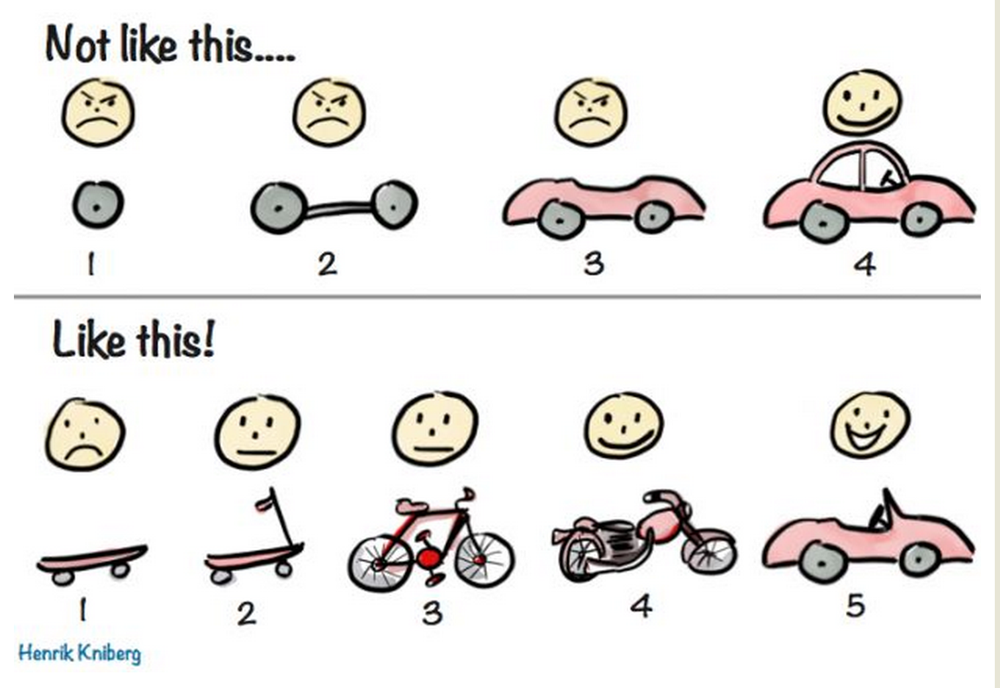

MVP（minimum viable product）は、:[リーン開発]:において最初に提供される、必要最小限の機能のみを備えた製品のこと。

リーン開発の際の注意点として、MVPは「最小限の機能」は「不十分かもしれないが、ユーザーのニーズを最低限満たせる製品」であって、「製造途中の製品」ではないという点が挙げられる。この注意点について説明したHenrik Knibergの以下のイラストがよく知られている。

